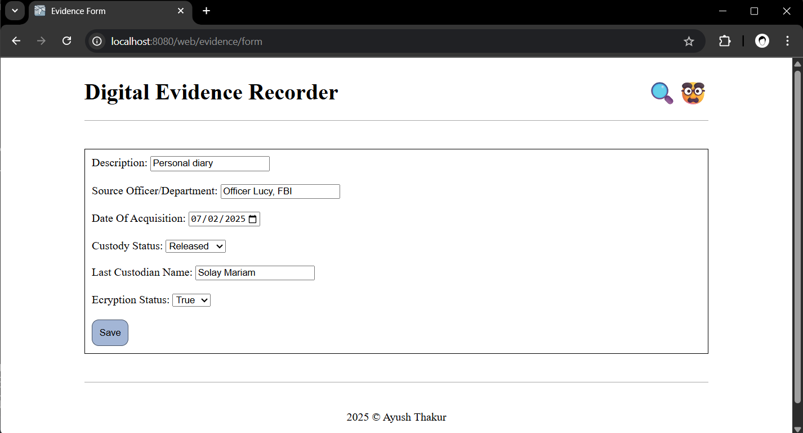

# Assignment 1 - Digital Evidence Recorder
`In This Assignment, We are creating a multi-module enterprise java application capable of recording the evidence, displaying it on webpages and sorting them.`

## Screenshots
1. Showing all evidences

2. Showing only in custody

3. Creating evidence form

4. Saving with form - save message

